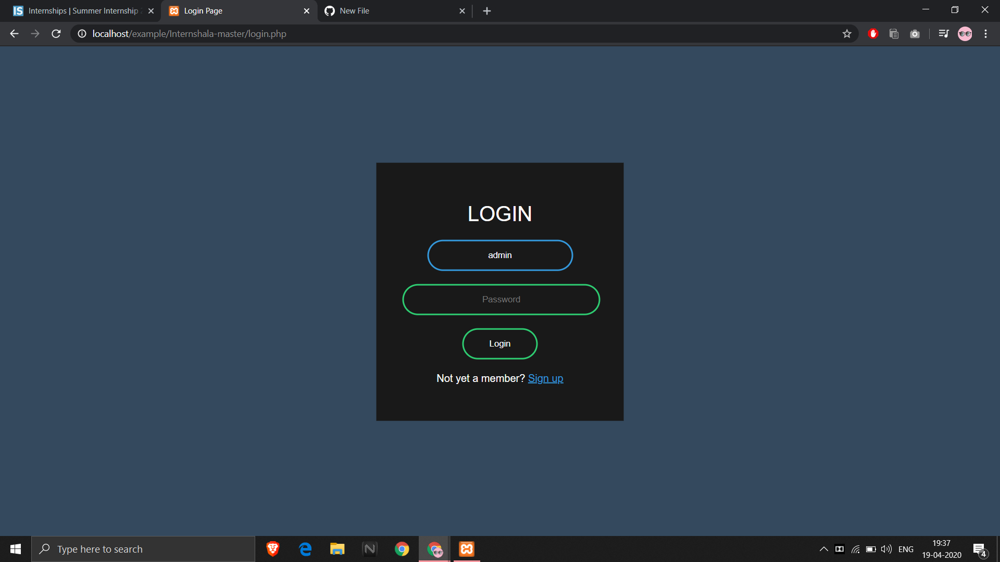
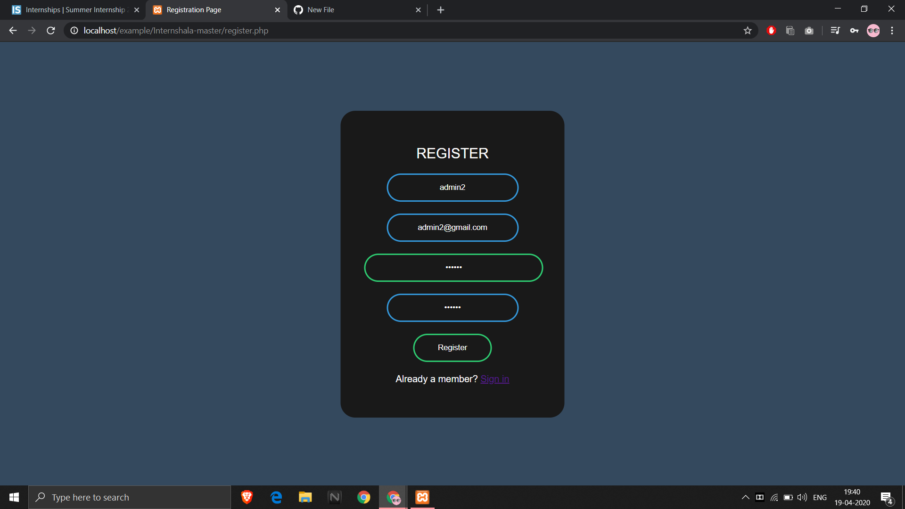
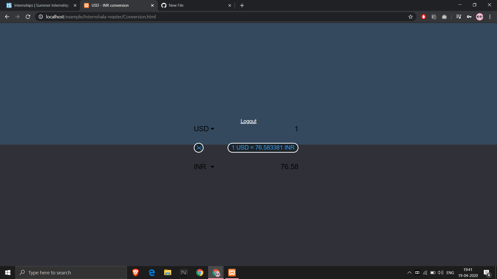
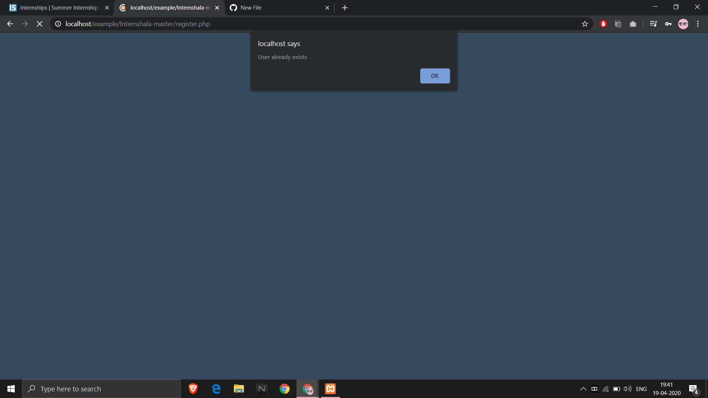

# Internshala:Yeshwanth Sangram And Co | Web Development

1)Clone or download the zip file into your htdocs folder in xampp with a suitable name.

2)Create a database with the name "registration".

3)Create a table with the name "person" and it should contain 4 columns (id,username,email,password).
                                             
                                             
                                             [OR]
Run the code below in your sql shell for creation of table:

  CREATE TABLE `person` (
              `username` varchar(100) NOT NULL,
              `email` varchar(100) NOT NULL,
              `password` varchar(100) NOT NULL
            ) ENGINE=InnoDB DEFAULT CHARSET=latin1;
            
The structure of the table looks as follows :

The Login Page:

If the user is new,by clicking on the Sign up button,the page will be redirected to registration page wherein the user can fill their details :

After filling the appropriate details,the details of the user are stored into the database and the after the newly registered user is logged in,he/she is redirected to the following page wherein the user can do the conversion from USD to INR or vice-versa:

If the already existing user tries to register with the same name ,the following prompt shows up :

If the username/password entered are incorrect,the following prompt shows up :

If the user doesn't enter his username during login,the following prompt shows up:

If the user doesn't enter his password during login,the following prompt shows up:

